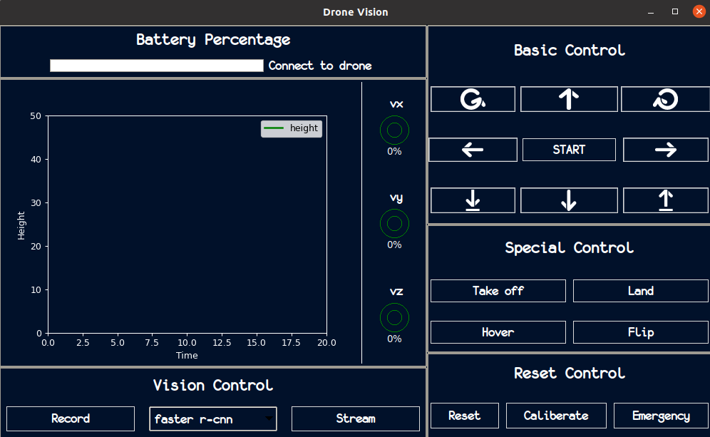
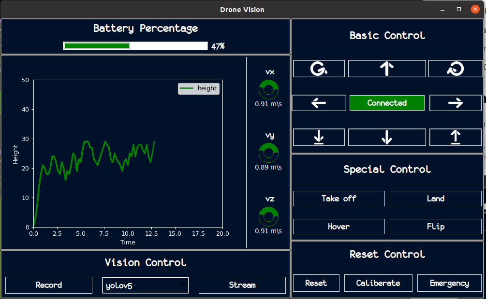
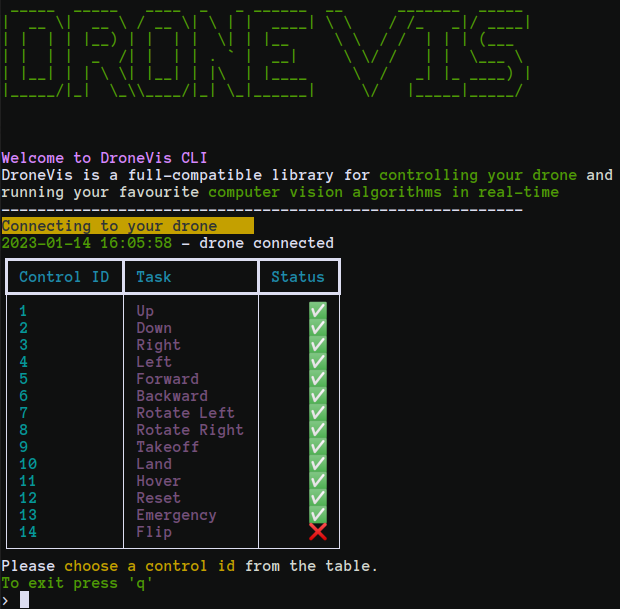
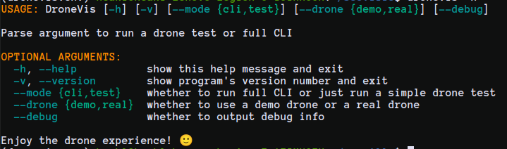

<p>


</p>

<p>


</p>

**`Documentation`** |
------------------- |
[](https://drone-vis.readthedocs.io/en/latest) |


# DroneVis: Full compatible drone library to automate computer vision algorithms on parrot drones.

**DroneVis** is a cutting-edge drone software library that has been specifically designed for use with the AR. Drone 2.0. It has been extensively tested both indoors and outdoors, and offers a wide range of features including adaptability in connecting to the drone, advanced computer vision algorithms, and a user-friendly interface. This makes it easy for users to take full advantage of the drone's capabilities and control it with simple commands.All of the implemented real-time data, inference, and detection achieve a minimum ``fps >= 4.5`` on an Intel core 8 CPU.

## Features
- Unified state-of-the art computer vision algoritms
- Full control over the drone
- PEP8 compliant (unified code style)
- Documented functions and classes
- Tests, high code coverage and type hints
- Clean code
- Multiple implementations for the same models
- Logger with timestamps
- Two UI for easier usage (GUI, CLI)

Here are the drone control functionalities:
|                   |                    |                   |                   |
|-------------------|--------------------|-------------------|-------------------|
| Right, Left       | Reset, Emergency   | Hover, Caliberate | Forward, Backward |
| Up, Down          | Rotate Left/Right  | Camera Stream     | Takeoff, Land     |

Here are the models implemented to provide vision for the drone:

| Computer Vision Model | Usage                 |   Implementation      |
|-----------------------|-----------------------|-----------------------|
| Faster R-CNN          | Detection/Recognition | PyTorch               |
| CenterNet             | Detection/Recognition | MxNet                 |
| YOLO                  | Detection/Recognition | MxNet                 |
| YOLOv5                | Detection/Recognition | PyTorch               |
| SSD                   | Detection/Recognition | PyTorch               |
| CSRNet                | Crowd Counting        | PyTorch               |
| BlazeFace             | Face Detection        | MediaPipe             |
| BlazePose             | Pose Estimation       | MediaPipe             |
| BlazePose             | Segmenation           | Mediapipe             |

## How to Install 

You start controling your drone now with just two commands:

```bash
pip install dronevis # install the library 
dronevis-gui # run library GUI
```

<p align="center">

</p>

Press the ``start`` button to start a demo drone simulation, and run your favourite algorithms with the ``stream`` button.


<p align="center">

</p>

You can control your drone with our ``CLI``:
```bash
dronevis
```

<p align="center">

</p>

> :warning: **If you are a Windows**: models implemented with Mxnet library are buggy.

## Getting Started 

Dronevis is built with multiple modes for customizibility. You can view all the options for either runnning our ``GUI`` or ``CLI`` as follows: 

```bash
dronevis --help
```

<p align="center">

</p>

The default mode for running either the CLI or the GUI is the ``demo`` mode. You can alter the mode by providing "real" to ``--drone`` argument.

```bash
dronevis --drone=real # cli real drone mode
```

or for GUI,

```bash
dronevis-gui --drone=real # gui real drone mode
```

## Documentation 

Dronevis is developed with an extensive documentation for easier user contributions. You can check our full documentation in [here](drone-vis.readthedocs.io/en/latest) to go more in-depth of **how the library is structure** and **how to contribute your favourite model**. 


## Citing the Project

To cite this repository:

```bibtex
@software{drone-vis,
  author  = {Ahmed Heakl, Abdallah-Elbarkokry, Fatma Youssef},
  title   = {Dronevis: Full compatible drone library to automate computer vision algorithms on parrot drones},
  year    = {2022},
  url     = {github.com/ahmedheakl/drone-vis},
  version = {0.2.2}
}
```
