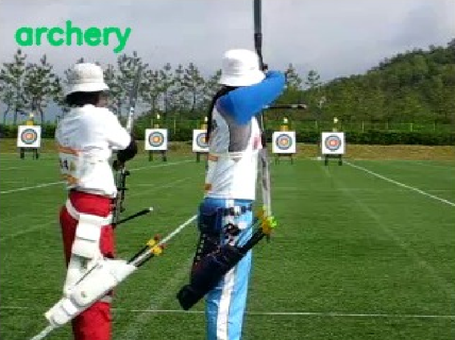

Time Space Transformer (TimeSformer)
====================================

Instead of applying joint space-time attention, which is time-consuming, a divided space and time attention is proposed in `here <https://proceedings.mlr.press/v139/bertasius21a.html#:~:text=Cite%20this%20Paper&text=frame%2Dlevel%20patches.-,Our%20experimental%20study%20compares%20different%20self%2Dattention%20schemes%20and%20suggests,among%20the%20design%20choices%20considered.>`_.
In this approach, each patch in an image is first used to compute temporal attention, with all patches having the same spatial index. The resulting
encoding is then used for computing spatial attention with patches having the same temporal index. This approach surpasses the usage of spatial attention
only or joint space-time attention in terms of accuracy. In addition, the inference cost of this approach is minimal compared to other well-known approaches
relying on 3D convolution, such as `SlowFast <https://arxiv.org/abs/1812.03982>`_.

Example
-------

    .. code-block:: python

        from dronevis.models import ActionRecognizer

        model = ActionRecognizer()
        model.load_model("facebook")
        model.detect_webcam()

