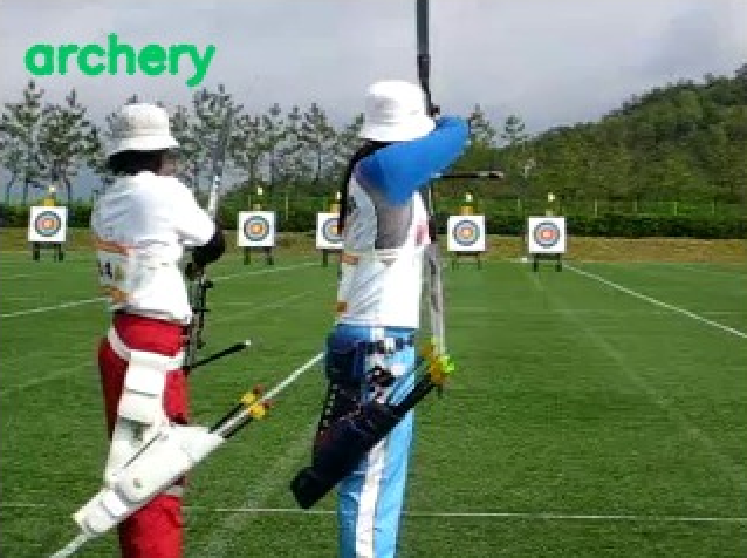

Video Masked Autoencoders (VideoMAE)
====================================

A tube masking strategy is proposed in `here <https://openreview.net/forum?id=AhccnBXSne>`_ to force the network to learn important features in a video. 
This is achieved by masking a large portion of cubes in the video (where cube embedding is used to represent one token) with negligible motion, reducing the 
computation cost and enhancing the model performance. The few remaining unmasked tokens are used with the vanilla Vision Transformer (ViT) to capture the 
spatiotemporal relation between them. This approach achieved state-of-the-art results on the `Kinetics-400 dataset <https://arxiv.org/abs/1705.06950>`_ with 87.4% accuracy, 
compared to 80.7% and 84.9% accuracy of TimeSformer and ViViT, respectively. In terms of inference cost, VideoMAE requires 7397 GFLOPS, while TimeSformer 
and ViViT require 8353 and 3981 GFLOPS, respectively.

Example
-------

    .. code-block:: python

        from dronevis.models import ActionRecognizer

        model = ActionRecognizer()
        model.load_model("mcg")
        model.detect_webcam()
