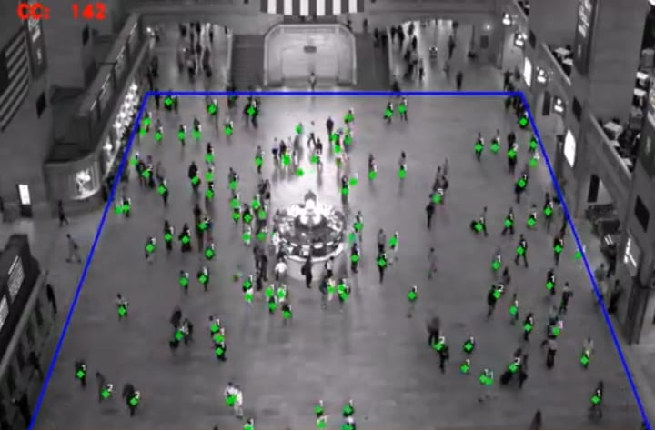

Cascaded MTL Crowd Counting
===========================

Crowd counting involves estimating the number of people in crowded scenes like urban areas, stadiums, and public events. Crowd counting is essential
with drones for monitoring gatherings, managing crowd flow, and assessing affected populations for disaster response in case of emergency.

Crowd counting encompasses various approaches, including detection-based, regression-based, and density-based regression counting. Detection-based crowd
counting involves detecting people in the scene using object detectors before estimating the crowd count. However, it may face challenges in detecting small
objects in highly crowded scenes. Regression-based crowd counting aims to directly estimate the crowd count; nonetheless, it can be sensitive to image
variations and clutter. In contrast, density-based crowd counting analyzes the overall crowd density in an image or video rather than counting individual
instances. The advantages of density-based methods include simplicity, efficiency, and adaptability; however, accuracy might be affected in complex scenes
with overlapping individuals or near image boundaries. To achieve low error rates and real-time performance, we adopt the cascaded convolutional neural
network proposed in, which leverages multi-task learning for crowd density map estimation and crowd count classification into distinct groups. The crowd count
classification acts as a high-level prior capturing scene-level information, while crowd density estimation focuses on local density information, leading to improved
accuracy in crowd counting tasks. An example of the output of the crowd counting model is depicted below:

Example
-------

    .. code-block:: python

        from dronevis.models import CrowdCounter

        model = CrowdCounter()
        model.load_model()
        model.detect_webcam()

Cascaded MTL Crowd Counting Class
---------------------------------

.. autoclass:: dronevis.models.CrowdCounter