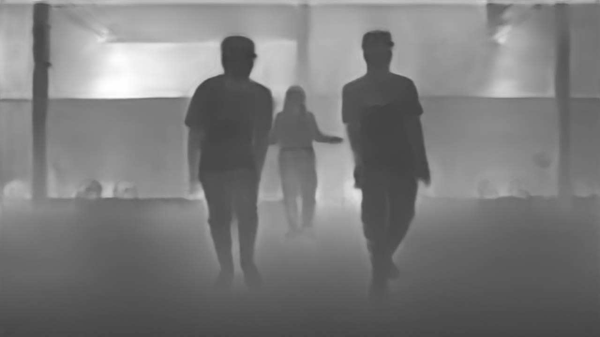

GLP Depth Estimation
====================

Monocular depth estimation means deducing the distance or depth information of objects within a scene from a single 2D image or video frame. This process facilitates comprehension of the spatial
arrangement of the environment and the relative separations between objects. When applied to drones, monocular depth estimation plays a crucial role in autonomous navigation, obstacle avoidance,
and scene understanding. By extracting depth cues from the drone's camera feed, the drone gains the ability to perceive its surroundings, gauge the elevation of obstacles or landmarks, and make
informed decisions to ensure secure and efficient flight. The method proposed in `GLP <https://arxiv.org/abs/2201.07436>`_ is utilized for this purpose. It consists of an encoder part implemented with transformers,
possessing a large receptive field for capturing global context. The decoder part aims to capture local features to preserve structural details and generate a detailed feature map facilitated by
skip connections and a selective feature fusion model that employs attention maps to pinpoint distinct features. This approach achieved state-of-the-art results on the `NYU Depth V2 dataset <https://cs.nyu.edu/~silberman/datasets/nyu_depth_v2.html>`_, yielding a root mean squared error of 0.344 with minimal parameter usage. An example of the depth estimation model is shown below where the darker parts of the image represent
nearer objects while the brighter regions represent more far objects.

Example
-------

    .. code-block:: python

        from dronevis.models import DepthEstimator

        model = DepthEstimator()
        model.load_model()
        model.detect_webcam()

GLP Depth Estimation Class
--------------------------

.. autoclass:: dronevis.models.DepthEstimator
