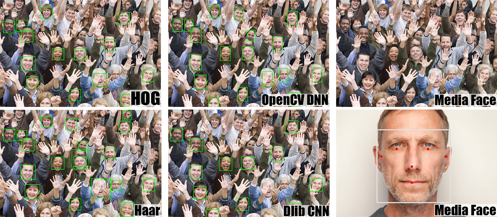

Face Detection Models
---------------------

Face detection focuses on the identification and localization of human faces within images or video frames. By utilizing advanced algorithms and machine learning models, face detection can analyze pixel patterns in an image to detect facial features like eyes, nose, and mouth, enabling the determination of the presence of a human face. 

We developed 5 models for a variety of options for face detection:

- `MediaPipe Face <https://developers.google.com/mediapipe/solutions/vision/face_landmarker>`_. (MediaPipe)
- `Haar Face <https://www.cs.cmu.edu/~efros/courses/LBMV07/Papers/viola-cvpr-01.pdf>`_. (OpenCV)
- `HOG Face <https://www.researchgate.net/publication/342886529_Face_Detection_Histogram_of_Oriented_Gradients_and_Bag_of_Feature_Method>`_. (Dlib)
- `Dlib CNN Face <http://dlib.net/cnn_face_detector.py.html>`_. (Dlib)
- `OpenCV DNN Face <https://docs.opencv.org/4.x/d0/dd4/tutorial_dnn_face.html>`_. (OpenCV)

Here is a comparison between the models outputs. 

