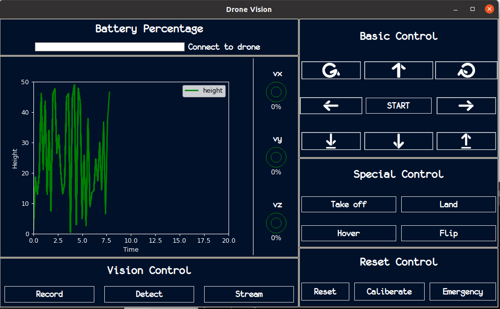
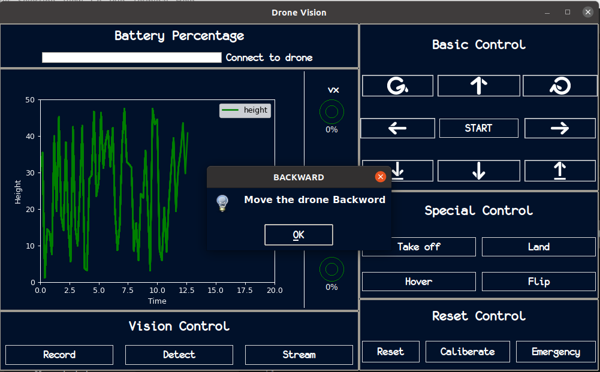

.. _quickstart:

Getting Started
===============

The library comes with two out-of-the-box interfaces:

1. Graphical User Interface
---------------------------

You can simply run the GUI interface as follows, which opens-up the GUI window under the name ``Drone Vis``:

.. code-block:: console

   (.dronevisvenv) $ dronevis-gui

You can *right-click* on any button to view its functionality. For example, here this info concerning the ``backwards`` button (represented by a downwards arrow):

1. Command-Line Interface
-------------------------

If you are not a GUI fan, you can use the command-line to run library and connect to the drone by specifying some command-line arguments. 

.. code-block:: console
    
    (.dronevisvenv) $ dronevis   

.. note::

    The library is built with default configurations, however, you can change those configurations by incorporating your own `.config` files. 
    .. See section :ref:`configs <yourconfigs>` for more details.
