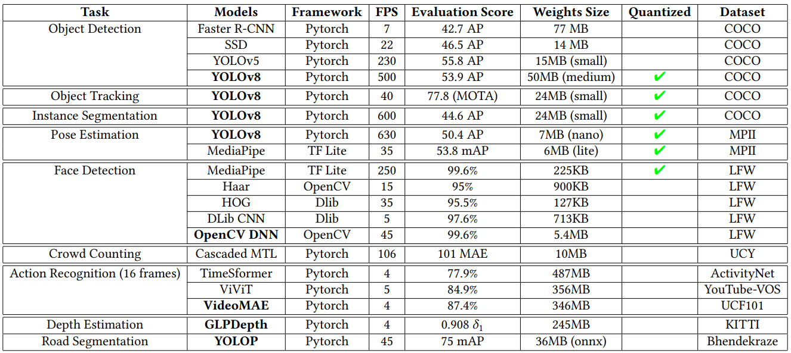

.. DroneVis documentation master file, created by
   sphinx-quickstart on Fri Dec 16 00:31:04 2022.
   You can adapt this file completely to your liking, but it should at least
   contain the root `toctree` directive.

Welcome to DroneVis's documentation!
====================================

**DroneVis** is a full compatible drone library to automate computer vision algorithms on parrot drones. The library and computer vision alogirthms were built with real-time constraints on-mind. 

All of the implemented real-time data, inference, and detection achieve a minimum ``fps >= 4.5`` on an *Intel core 8* CPU.

Github repository: https://github.com/ahmedheakl/drone-vis

Check out the :doc:`guides/install` section for further information, including how to
install the project.

Main Features
-------------

- Unified state-of-the art computer vision algoritms
- Full control over the drone
- PEP8 compliant (unified code style)
- Documented functions and classes
- Tests, high code coverage and type hints
- Clean code
- Multiple implementations for the same models

Computer Vision Models
----------------------

Drone Controls
--------------
The library supports all of the following drone controls. The drone can be controlled using the keyboard or the GUI.

- Right ➡️, Left ⬅️
- Up ⬆️, Down ⬇️
- Forward ▶️, Backward ◀️
- Takeoff 🚀, Land 🛬
- Reset 🔄, Emergency 🚨
- Rotate Left ↩️ /Right ↪️
- Hover 🔍, Calibrate 🔧
- Camera Stream 📹/Record ⏺️
- Hand Gesture Control 🖌️

.. toctree::
   :maxdepth: 2
   :caption: User Guide

   guides/install
   guides/quickstart

.. toctree::
   :maxdepth: 2
   :caption: Connections

   connection/drone_connection
   connection/drone
   connection/command
   connection/video

.. toctree::
   :maxdepth: 2
   :caption: Object Detection

   detection/detect_algo
   detection/ssd
   detection/yolo
   detection/fasterrcnn

.. toctree::
   :maxdepth: 1
   :caption: Instance Segmentation

   segmentation/yolov8_segment

.. toctree::
   :maxdepth: 2
   :caption: Pose Estimation

   pose/mediapipe
   pose/yolov8_pose

.. toctree::
   :maxdepth: 1
   :caption: Face Detection

   face_detect/face_detection
   face_detect/mediapipe_face_detection
   face_detect/haar_face_detection
   face_detect/hog_face_detection
   face_detect/dlib_cnn_face_detection
   face_detect/opencv_dnn_face_detection

.. toctree::
   :maxdepth: 1
   :caption: Crowd Counting

   crowd_counting/mtl_counting.rst

.. toctree::
   :maxdepth: 1
   :caption: Depth Estimation

   depth_estimation/glp_depth

.. toctree::
   :maxdepth: 1
   :caption: Action Recognition

   action_recognition/action_recognition_models
   action_recognition/times_transformer
   action_recognition/video_vision_transformer
   action_recognition/video_masked_transformer

.. toctree::
   :maxdepth: 1
   :caption: User Interfaces

   interfaces/gui
   interfaces/commandline
   interfaces/gesture_control

Indices and tables
==================

* :ref:`genindex`
* :ref:`modindex`
* :ref:`search`
