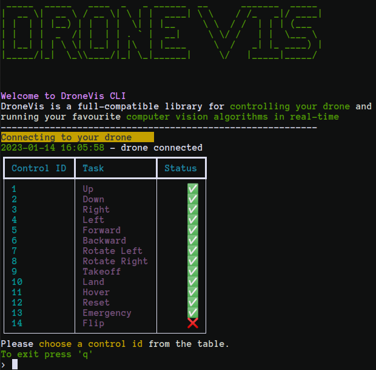

Command-Line Interface
======================

The library also incorporates CLI, a resource-efficient user interface that is favoured for devices with limited computing power. CLI efficiently manages
processing and memory resources, ensuring, ensuring effective communication with the drone. CLI is designed mainly for systems that lack a graphical user
interface (GUI) window, making it well-suited for remote services and situations where GUI interactions are not feasible. Unlike GUI, CLI relies solely on 
text-based commands for controlling drone movement. It doesn't include graphical features, which are common in GUI, especially in the context of vision tasks. In the absence of GUI's visual outputs, CLI focuses on command-driven control, while most vision-related outputs typically involve displaying results in a separate window, showcasing camera feed images captured by the drone.

To start the CLI, the user should simply write the following command from the terminal:
        
.. code-block:: console

    $ dronevis

Executing this command will bring up the CLI Interface shown below:

