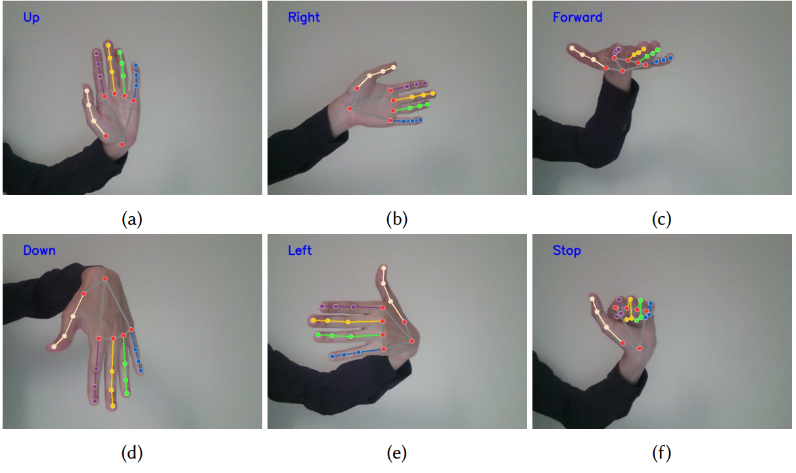
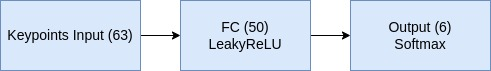

Gesture Recognition Control
===========================

While user interfaces provide comprehensive access to drone functions, including movement control and various computer vision tasks through the drone's camera, they necessitate proximity to a
computer device. In cases where simple drone movement control is sufficient, hand gesture control can offer enhanced intuitiveness and interactivity compared to traditional user interfaces.
The DroneVis library enables straightforward drone control using hand gestures. To achieve this capability, `the Mediapipe hands model <https://developers.google.com/mediapipe/solutions/vision/hand_landmarker>`_
is employed to extract the keypoints of each hand, yielding 3D coordinates for 21 keypoints. Six distinct gestures are utilized for drone control, as showcased below. 

A small dataset comprising 328 images encompassing these six gestures is collected for training a gesture classifier model, as depicted in the figure below.

The model's input consists of the 63-dimensional keypoints extracted by Mediapipe 21x3, representing the x, y, and z coordinates of the 21 keypoints.
The classifier network incorporates a single fully connected layer with 50 units, followed by a leaky ReLU activation, and an output layer with 6 units
corresponding to the six gestures, followed by a softmax activation. Layer count and sizes are empirically determined for optimal performance, ensuring
real-time feasibility for drone control. The dataset is partitioned into 80% training, 10% validation, and 10% testing sets, with label stratification
to account for minor class imbalances. 

The gesture recognition is incorporated by default into the GUI, yet you can run it manually like any other model and control its parameters:

.. code-block:: python

    from dronevis.models import GestureRecognition

    model = GestureRecognition()
    model.load_model()
    model.detect_webcam()

Gesture Recognition Class
-------------------------

.. autoclass:: dronevis.models.GestureRecognition