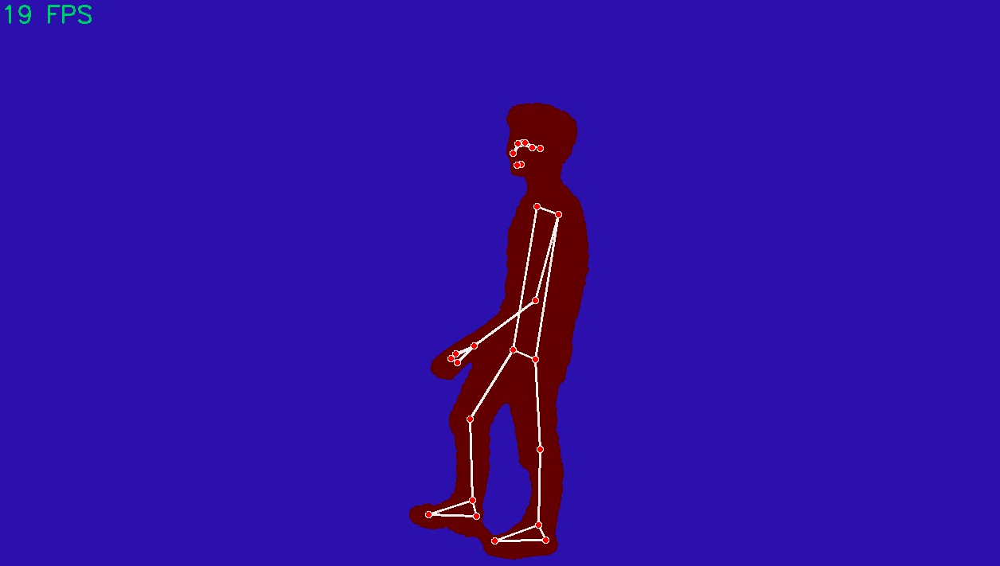

MediaPipe Pose
==============

MediaPipe Pose Estimation is based on the `Blazepose architecture <https://arxiv.org/abs/2006.10204>`_. Unlike YOLOv8-Pose, MediaPipe provides 33 3D 
keypoints in real-time. These keypoints are a superset of the 17 keypoints provided by YOLOv8 (COCO dataset keypoints), and they also include keypoints for 
the face, hands, and feet (found in `BlazeFace <https://arxiv.org/abs/1907.05047>`_ and `BlazePalm <https://arxiv.org/abs/2006.10214>`_). The pipeline of this pose estimation 
involves first detecting a person in the image using a face detector and then predicting the keypoints, assuming that the face is always visible. MediaPipe 
Pose Estimation is mainly designed for fitness applications for a single person or a few people in the scene.

Example
-------
    .. code-block:: python

        from dronevis.models import PoseSegEstimation

        model = PoseSegEstimation()
        model.load_model()
        model.detect_webcam()

MediaPipe Pose Class
--------------------

.. autoclass:: dronevis.models.PoseSegEstimation
