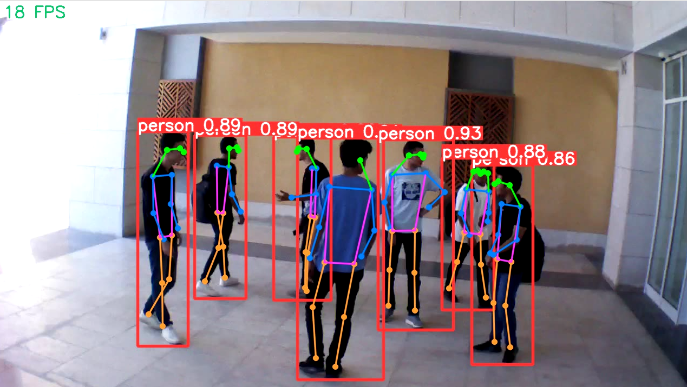

YOLOv8 Pose
===========

Another feature provided by YOLOv8 is pose estimation. For this task, YOLOv8 was pretrained on the COCO dataset. The model outputs 17 2D keypoints with an 
mAP50 of 90.2, corresponding to mean Average Precision at a 50% IoU threshold. The model runs in real-time and accurately estimates the pose even in crowd 
scenes. 

Example
-------

    .. code-block:: python

        from dronevis.models import YOLOv8Pose

        model = YOLOv8Pose()
        model.load_model()
        model.detect_webcam()

YOLOv8 Pose Class
-----------------

.. autoclass:: dronevis.models.YOLOv8Pose