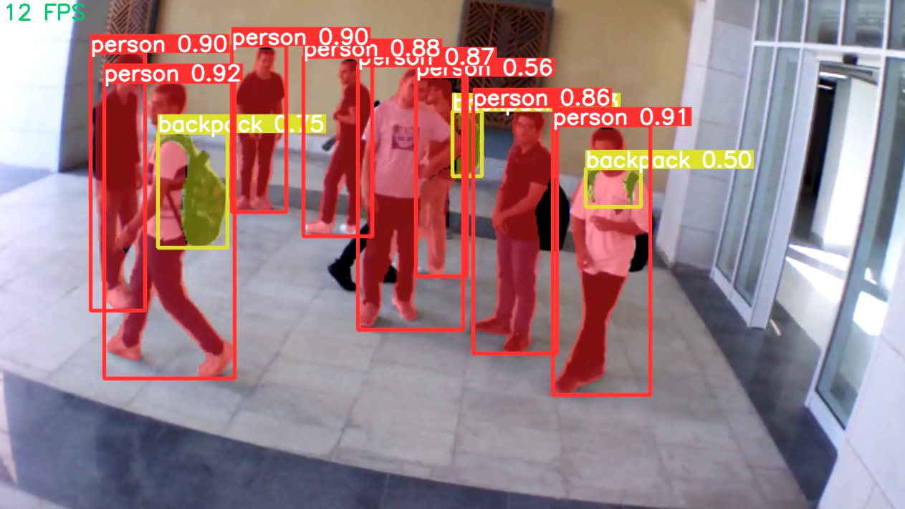

YOLOv8 Segmentation
===================

Instance segmentation goes beyond object detection by not only identifying individual objects in an image but also accurately segmenting them from the 
surrounding background. The result of an instance segmentation model is a collection of masks or contours outlining each object in the image, accompanied by 
class labels and confidence scores for each object. Instance segmentation is particularly valuable when detailed information about object boundaries and 
shapes is necessary, in addition to their spatial locations within the image. For this task, we used YOLOv8 which enables instance segmentation with mAP mask 
of 43.4 where the mAP mask metric measures the average precision of how well the model's predicted masks match the ground truth masks for each object 
instance in the image. An example of the output of the segmentation model is shown below:

Example
-------
    .. code-block:: python

        from dronevis.models import YOLOv8Segmentation

        model = YOLOv8Segmentation()
        model.load_model()
        model.detect_webcam()

YOLOv8 Segmentation Class
-------------------------

.. autoclass:: dronevis.models.YOLOv8Segmentation
