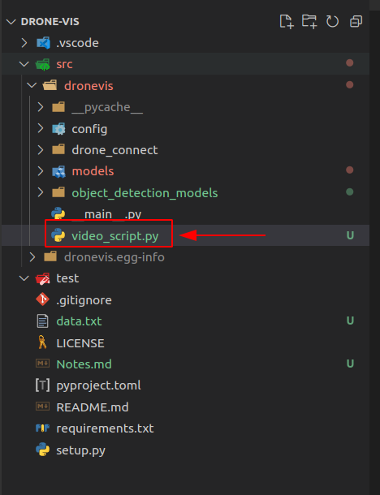
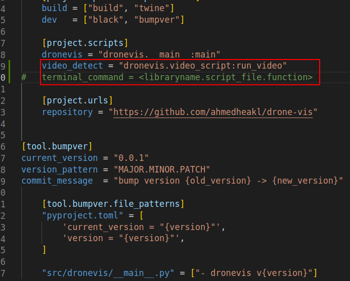
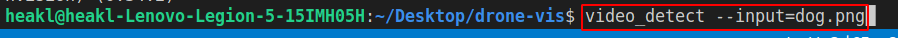
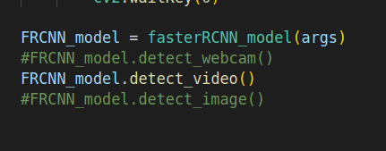

# Notes for Better Readability 
1. Class names should be pascal case: ``fasterRCNN_model`` -> ``FasterRCNNModel``.
2. Parsers should be in their own files as scripts. For example, you can a separate script for running a video stream: 

###### Adding a script file
<p align="center">
    
</p>

###### Adding script command into the library configs
From `pyproject.toml` in `[project.scripts]` section, add your script file and it should be called from the terminal. 
<p align="center">
    
</p>

###### Run from terminal 
You can now run the script from the terminal with the required parser args. 
<p align="center">
    
</p>


3. Don't use direct command in src files, like so: 
<p align="center">
    
</p>

You can rather use, 
```python
if __name__ == "__main__":
    # your code here
```
so that your testing code won't run in the production env. 


You can also add a script in `examples` folder as docs to the end user. 


4. Too much comments are not needed, the code *should speak for itself*. 


